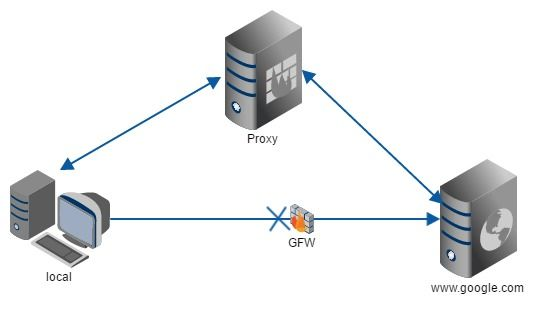

## Nginx
### 一、前言：
#### *1、什么是Nginx？*    
Nginx 是一款高性能的 Web和 反向代理 服务器，简单来说就是和apache-tomcat、express、koa是一个性质的东西，都是WEB服务器。

#### *2、Nginx可做什么*
1. 做服务器代理，解决跨域问题（正向代理）。
2. 提供静态文件服务（前端项目存放处）。
3. 作为图片资源网络资源服务器。
4. 为多台服务器之间做负载均衡（反向代理）。
5. Nginx可以对不同的文件做不同的缓存处理，配置灵活。

#### *3、正向代理和反向代理的区别：*
##### 正向代理：


`正向代理 是一个位于客户端和原始服务器(origin server)之间的服务器，为了从原始服务器取得内容，客户端向代理发送一个请求并指定目标(原始服务器)，然后代理向原始服务器转交请求并将获得的内容返回给客户端。`

例如翻墙、vpn、代理解决跨域、爬虫


##### 反向代理：
`基本上就是一个服务端的负载均衡器，在计算机世界里，由于单个服务器的处理客户端（用户）请求能力有一个极限，当用户的接入请求蜂拥而入时，会造成服务器忙不过来的局面，可以使用多个服务器来共同分担成千上万的用户请求，这些服务器提供相同的服务，通过一台代理服务器集成，对于用户来说，根本感觉不到任何差别。`

例如  服务端的负载均衡器


总结：
1. 正向代理是代理(v)客户端，为客户端收发请求，使真实客户端对服务器不可见。
2. 反向代理是代理(v)服务器，为服务器收发请求，使真实服务器对客户端不可见。
3. 因为服务对象和自身角色不同，所以刚好是相反的。（v代表动词）
4. 相对于代理的服务器来说，两者的区别在于代理的对象不一样：正向代理代理的对象是客户端，反向代理代理的对象是服务端。


---
### 二、安装
[下载nginx](http://nginx.org/en/download.html)

* 解压，存放在心仪的，这里我们存放到 `G:\`， 注意目录中不能有中文
* 打开cmd,进入`G:\nginx-1.14.1` 目录,
* 运行命令`start nginx`启动nginx服务。访问localhost:80（默认，可以自己设置）测试是否访问成功。
>至此，nginx服务器安装和启动完毕

---
### 三、常用nginx命令：
* 验证配置是否正确: nginx -t
* 查看Nginx的版本号：nginx -V
* 启动Nginx：start nginx
* 配置文件修改重装载命令：nginx -s reload
* 快速停止或关闭Nginx：nginx -s stop
* 正常停止或关闭Nginx：nginx -s quit
* window下终止所有的nginx进程命令：taskkill /im nginx.exe /f
>tip：多次在没有nginx -s stop 的情况下 start nginx 会启动多个nginx服务，而且通过 nginx -s stop 只能关闭最后一个nginx进程，通过`taskkill /im nginx.exe /f`这种方式可以关闭所有的nginx进程。
window下测试nginx,感觉好像配置修改后不生效，服务器关了还能访问，因为后台没有真正关闭nginx服务，在任务管理器中可以查看到有多个nginx服务，可以通知这种方式结束nginx任务。

---
### 四、把nginx作为静态资源服务器：
*nginx.conf文件中，http指令增加一个server指令，配置如下，启动或重载nginx,访问 localhost:3000/+ 项目具体路径*
```
    server {
        listen       3000;
          # 前端静态文件路径
		location / {
            root   F:\biguiyuan\project;
            # 缓存过期时间
            expires 3d;
        }
    }
```

---
### 五、把nginx作为静态资源服务器，并且提供正向代理服务器：
*nginx.conf文件中，http指令增加一个server指令，配置如下，启动或重载nginx,访问 localhost:3000/+ 项目具体路径*
* 第1个location指令匹配所有前缀为api的请求，并交给http://localhost:8000服务（tomcat/express）处理。前端访问localhost:3000/api/test 会代理到 =》localhost:8000/api/test，就像webpack-dev的proxyTable服务器代理,解决跨域问题。

```
server {
        listen       3000;
		  # 前端静态文件路径
		location / {
            root   F:\biguiyuan\project;
            # 缓存过期时间
            expires 3d;
        }
        # index.html不使用缓存
        location ~* \index.html$ {  
    		root   F:\biguiyuan\project;
		    expires -1; 
		}
		#api为后端文件夹名称
		location /api/ {
	         proxy_pass http://localhost:8000;
	    }
    }
```

---
### 六、把nginx设置为反向代理服务器，实现负载均衡：
```
 #配置负载均衡的服务器
upstream myapp {
       		# ip_hash; # 使用这个指令，会分析ip地址再去分配该请求，确保一个客户只和一台服务器通信，解决session\cookies共享问题
            server localhost:4000; #express服务
            server localhost:8000; #express服务
}
server {
    listen       3000;
    # 后端接口负载均衡
	location ^~ /api/ {
        proxy_pass http://myapp;
    }
    # 前端页面负载均衡，设置静态文件路径需要在 upstream 2个server中配置
    location / {
		proxy_pass http://myapp;
    }
}
```

---
### 七、原配置参数解读：
nginx.conf配置参数亲测：
```
server {
        listen      7000;  #端口，默认80
    server_name  test.com; #？？

		location / {                   location指令后面为为匹配url的规则，相当于if，/前端文件匹配进这里
            root   html;
            index  index.html index.htm;
        }
        location /aaa/ {  #匹配localhost:7000/aaa/  把root替换了localhost:7000 然后查找资源，实际查找路径为 G:\www\aaa\index.html
            root   G:\www;   root 指令声明了要查找文件的目录。Nginx 会把请求的 URI 添加到 root 指令指定的路径之后，来获取请求文件对应的目录。root 指令可以放在 http、server 或 location 上下文的任何位置。 没有root指令会使用server下的root指令

            index  index.html index.htm 50x.html;  index 指令中可以列出多个文件。Nginx 会按顺序查找文件并返回第一个找到的文件。
            autoindex on;   与index只能存在一个，谁先写谁生效，autoindex 指令如果设置为 on，则 Nginx 会返回自动生成的目录列表：
        }
   }

```
location匹配优先级排序：

1. 等号类型（=）的优先级最高。一旦匹配成功，则不再查找其他匹配项。（location = abc ）
2.^~类型表达式。一旦匹配成功，则不再查找其他匹配项。（location ^~ /images/）
3.正则表达式类型（~ ~*）的优先级次之。如果有多个location的正则能匹配的话，则使用正则表达式最长的那个。（location ~* \.(gif|jpg|jpeg)$）
4.常规字符串匹配类型。按前缀匹配。（location /documents/ ）


---

### 七、开启gzip：
指服务器返回资源前先经过压缩在返回，减少资源体积，加快请求速度，减少请求使用的流量。
在#gzip注释下增加配置：
```
gzip  on; #开启压缩传输功能
gzip_min_length 1k; #大于1K的文件才压缩
gzip_buffers 4 16k;
gzip_http_version 1.0;
gzip_comp_level 6; #压缩等级， 1-9，等级越高压缩得越慢
gzip_types  application/javascript text/plain application/json application/x-www-form-urlencoded text/css application/xml text/javascript application/x-httpd-php image/jpeg image/gif image/png;#匹配请求的contentType，这些contentType类型的内容会进行gzip压缩
gzip_disable "MSIE [1-6]\.";#ie6一下的浏览器不使用gzip功能
gzip_vary on;#添加vary响应头,验证缓存
```

### 八、自定义404页面
* 在http/或server/或location下配置 proxy_intercept_errors on;  启用自定义错误页面,开启根据请求返回的状态码进行页面跳转的功能,默认off,当被代理的请求响应状态码大于等于300时，决定是否直接将响应发送给客户端，亦或将响应转发给nginx由error_page指令来处理。
* 在server下配置 error_page (例如：error_page  404  http://www.baidu.com;) 表示状态码为404时跳转至百度页面
```
#server中的配置
error_page   404  /404.html; #状态吗     重定向的地址
location = /404.html {
    root   html;  /在html文件夹下要有404.html页面
}

```
每个server或location可以单独配置自己的proxy_intercept_errors on和error_page


### 九、nginx的配置语言和内置参数
#### 配置语言：
* proxy_set_header 代理时设置请求头
* proxy_pass  代理到...
#### 内置参数：
* $remote_addr ：#发出请求的访问地址的IP地址
```
proxy_set_header X-Real-Ip $remote_addr;  X-Real-IP请求头一般只记录真实发出请求的客户端IP
```
* $proxy_add_x_forwarded_for ：#请求的请求头中的"X-Forwarded-For"，与$remote_addr（请求的IP地址）两部分，他们之间用逗号分开。
```
举个例子，有一个web应用，在它之前通过了两个nginx转发，即用户访问该web通过两台nginx。 
在第一台nginx中,使用 
proxy_set_header            X-Forwarded-For $proxy_add_x_forwarded_for; 
现在的$proxy_add_x_forwarded_for变量的"X-Forwarded-For"部分是空的，所以只有$remote_addr，而$remote_addr的值是用户的ip，于是赋值以后，X-Forwarded-For变量的值就是用户的真实的ip地址了。 
到了第二台nginx，使用 
proxy_set_header            X-Forwarded-For $proxy_add_x_forwarded_for;
现在的$proxy_add_x_forwarded_for变量，X-Forwarded-For部分包含的是用户的真实ip，$remote_addr部分的值是上一台nginx的ip地址，于是通过这个赋值以后现在的X-Forwarded-For的值就变成了“用户的真实ip，第一台nginx的ip”，这样就清楚了吧。
```
* $http_host：#请求地址，即浏览器中你输入的地址（IP或域名）
* $scheme ：   #请求使用的Web协议，"http" 或 "https"
```
proxy_set_header X-Forwarded-Proto $scheme; 设置代理请求的和原协议保持一致协议
```
### 注意点：
1. nginx服务可以根据请求的路径，通过location指令分别控制他们的缓存机制，重定向寻找资源的位置...等各种各样的操作，(通俗来说：如果请求路径中包含XXX，那就....)
2. 通过nginx服务器正向代理后，谷歌浏览器network显示的响应头信息**是 proxy_pass指令指向的服务设置的，而不是nginx服务设置的。请求头时前端设置的，也不是nginx设置的**。
>正向代理只是起到一个桥梁的左右，可以设置多个桥梁，例如前端请求node服务代理，node代理请求nginx搭理，nginx搭理请求真正的后台。
3. nginx正向代理服务也支持跨域，即*浏览器访问的地址的协议域名端口*与*nginx代理服务的协议域名端口*可以不一致。
>（例如：访问地址localhost:8080、nginx地址：localhost:3000、后端地址：localhost:8000）这种情况会出现跨域，因为访问地址localhost:8080与请求地址localhost:3000不同，会导致跨域，需要在localhost:8000的服务上设置响应头支持跨域。       


附：[nginx 配置文件中的nginx的location配置详解](https://www.cnblogs.com/sign-ptk/p/6723048.html) 
### 遇见的报错error
nginx: [emerg] invalid number of arguments in "root" directive    
root参数的属性值无效，（路径错误）